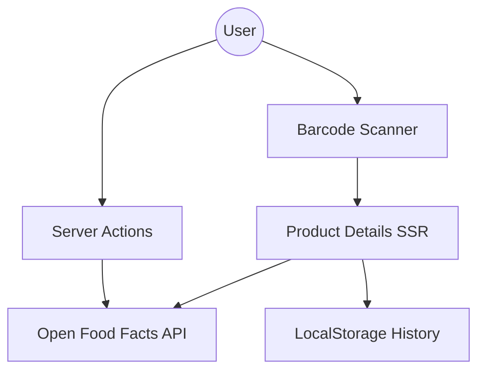

# 📚 Project Wiki

Welcome to the Open Food Facts "Techy & Premium" project documentation. This wiki serves as the central knowledge base for developers and contributors.

## 🏁 Onboarding

### 🛡️ Principal-Level Guide
> For senior contributors and architects.

**The Core Insight**: This app is essentially a "Reactive Proxy" to the Open Food Facts API. Instead of a traditional database, we treat the OFF API as our primary source of truth, but we overlay a sophisticated scoring engine and local persistence layer to enhance the user experience.

#### 🗺️ System Architecture

**Strategic Direction**: Moving towards a PWA (Progressive Web App) to allow full offline scanning capabilities and more native-like push notifications for product updates.

---

### 🚀 Zero-to-Hero Learning Path
> New to the project? Start here.

- **Part I: Foundations**: Familiarize yourself with [Next.js 15+](https://nextjs.org/docs) and [Tailwind CSS 4](https://tailwindcss.com/blog/tailwindcss-v4-alpha).
- **Part II: Architecture**: Read [ARCHITECTURE.md](ARCHITECTURE.md) to understand how we structure the app.
- **Part III: Setup**: Follow the "Getting Started" guide in [README.md](README.md).
- **Part IV: Contribution**: Check [DEVELOPMENT.md](DEVELOPMENT.md) for our UI/UX standards.

---

## 📖 Documentation Catalog

### 🏗️ Foundation
- **[README.md](README.md)**: Main project overview and setup.
- **[ARCHITECTURE.md](ARCHITECTURE.md)**: Design patterns and directory structure.
- **[DEVELOPMENT.md](DEVELOPMENT.md)**: Coding standards and UI principles.

### 🔌 Technical Reference
- **[API.md](API.md)**: Internal Server Actions and OFF API usage.
- **[FEATURES.md](FEATURES.md)**: Deep dive into Scanner, Scoring, and History.

### 🛠️ External Resources
- [Open Food Facts API Documentation](https://openfoodfacts.github.io/api-documentation/)
- [OFF Node.js SDK](https://github.com/openfoodfacts/openfoodfacts-nodejs)

---

## 📋 Glossary

| Term | Definition |
|------|------------|
| **Nutri-Score** | A nutrition label that summarizes the nutritional quality of food products. |
| **Eco-Score** | An indicator of the environmental impact of food products. |
| **NOVA** | A classification that groups foods according to the extent and purpose of industrial processing. |
| **Glassmorphism** | A design style using background blur and transparency to create a frosted glass effect. |
| **Server Action** | An asynchronous function that runs on the server, typically used for data mutations in Next.js. |
